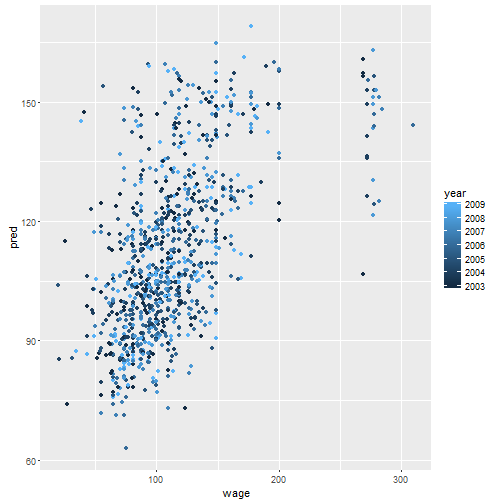

## Wage Prediction: Objective and Methodology

Predict wage of male workers in mid-altlantic region, using Wage dataset in ISLR package in R. 

- Explore data and variable relations using scatter plots
- Identify the variables to be used as predictors
- Split dataset into a 70% training & 30% testing set
- Build a linear regression model using multiple covariates on the training set 
- Validate the model using the testing set
- Predict wages for new inputs! 

---

## Scatter plots: Data Exploration

---

## Predicted vs. actual wages: Validation

---

## Conclusion

- Model built uses age, education, jobclass and health as predictors of wage

- Validation against test data shows high accuracy for predicted wages

- Alternate model can use other variables in dataset like health insurance and race

- There are some data points where predictions and actuals dont align well. Those need further investigation

See the wage prediction Shiny application built using this model [here](https://ribham.shinyapps.io/shiny/)!

